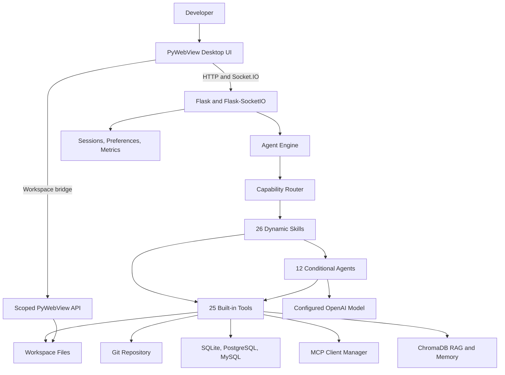
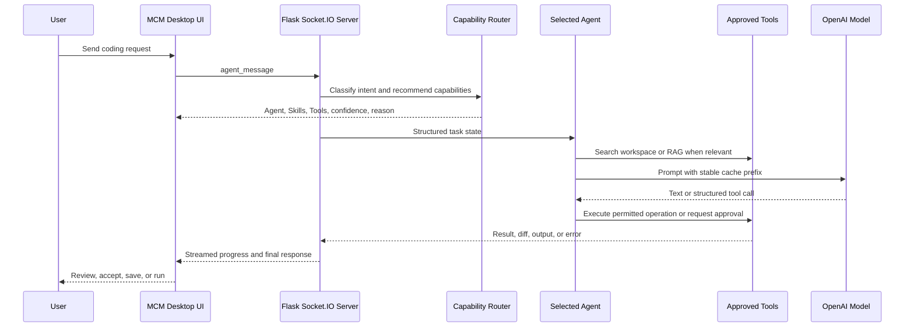
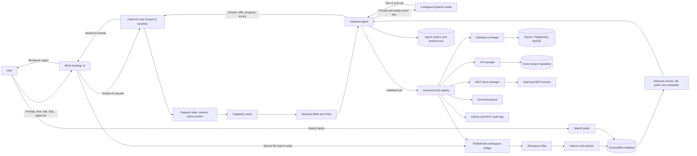
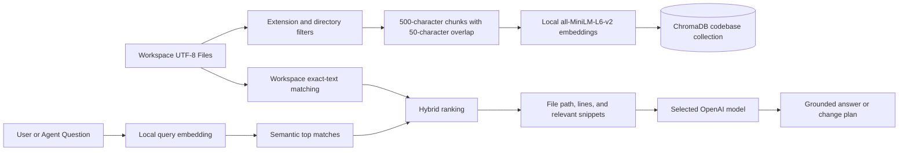
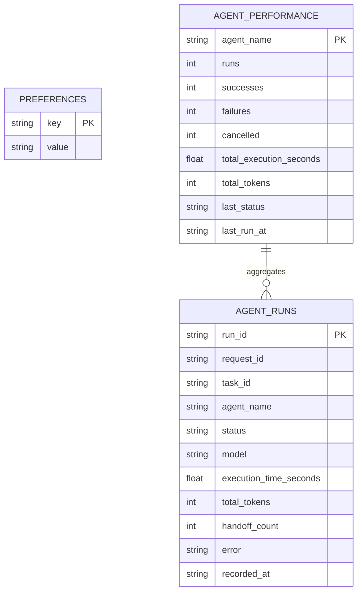
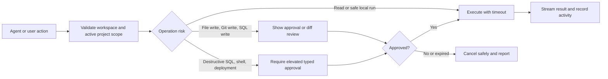
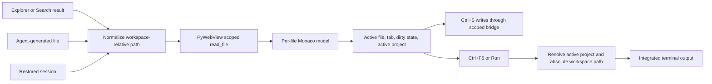
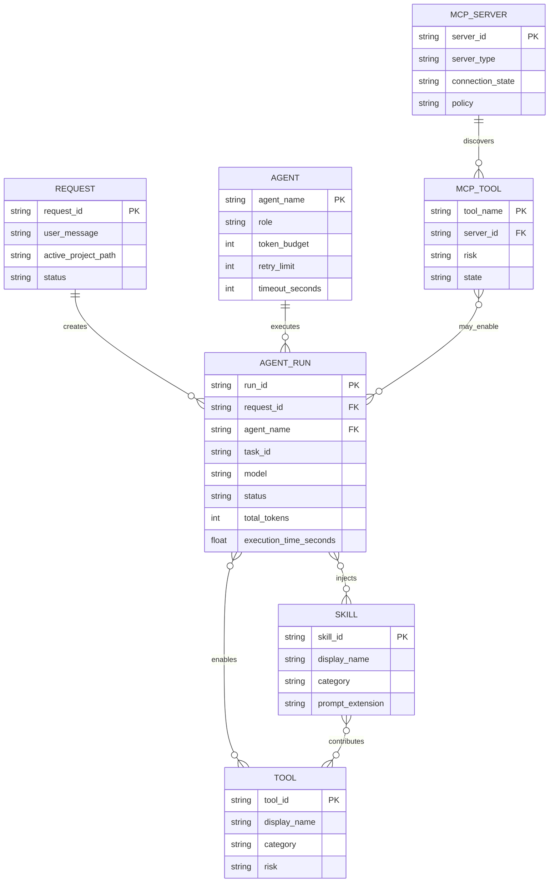
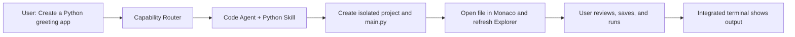

# Mighty Coding Machine (MCM)

[](https://www.python.org/)
[](https://flask.palletsprojects.com/)
[](https://platform.openai.com/)
[](https://pywebview.flowrl.com/)

Mighty Coding Machine (MCM) is a Windows desktop coding agent for building, understanding, debugging, reviewing, and operating software projects from one IDE-style workspace. It combines a Flask + Flask-SocketIO backend with a native PyWebView shell, Monaco Editor, xterm-style terminal output, SQL tooling, persistent memory, and local semantic code search.

## Devpost Submission Guide

### What MCM Demonstrates

MCM turns an implementation request into a visible local-development workflow: it routes work to a focused specialist,
generates and reviews changes, saves them inside a workspace-confined project, opens the result in Monaco, and runs the
active file through an integrated Windows terminal. The same desktop workspace also supports semantic codebase search,
Git source control, SQL exploration, persistent session history, and opt-in MCP extensions.

### Reproducible Setup

1. Install Python 3.14 or newer and Git for Windows.
2. Create and activate the virtual environment, then install `backend/requirements.txt` as shown in [Quick Start](#quick-start).
3. Copy or edit `backend/.env` and set `OPENAI_API_KEY`. The `MODEL` value selects the OpenAI model used by live agent requests.
4. Run `python app.py`, or launch `dist-mcp/My MCM/My MCM.exe` from its complete distribution directory.
5. In chat, request a small Python project, review the generated change, and select **Run** to execute the active file.

### Sample Data

No external dataset is required. MCM creates projects in its workspace and indexes them locally. For a short database
demo, connect SQLite to a workspace file such as `sqlite:///demo.db`, then run these statements separately in the Database panel:

```sql
CREATE TABLE IF NOT EXISTS todos (
    id INTEGER PRIMARY KEY,
    title TEXT NOT NULL,
    done INTEGER NOT NULL DEFAULT 0
);

INSERT INTO todos (title, done) VALUES ('Prepare MCM demo', 1);
SELECT * FROM todos;
```

### How GPT-5.6 and Codex Accelerated Development

GPT-5.6 and Codex were used as an engineering collaborator during development: they accelerated repository exploration,
startup and request-flow debugging, focused Python and JavaScript changes, test creation, security review, documentation,
and PyInstaller packaging verification. The final architecture and implementation decisions were reviewed and directed by
the project author, Rajab Baig. MCM itself uses the OpenAI API model configured through `MODEL`; model availability and
access are controlled by the user's OpenAI account.

### Key Technical Decisions

- **Windows reliability:** Flask-SocketIO uses standard threading rather than eventlet, and the Flask server starts in a daemon thread before PyWebView opens the native window.
- **Safe local operations:** Workspace-root validation, SQL confirmation, approval levels, and constrained tool execution protect local files and sensitive actions.
- **Local-first code intelligence:** ChromaDB default embeddings keep RAG and memory useful without requiring an OpenAI key for retrieval.
- **Conditional specialists:** Agents, skills, and tools are routed by request intent, avoiding expensive multi-agent chains for simple work.
- **Practical distribution:** PyInstaller uses `--onedir` so PyWebView, Flask, ChromaDB, and bundled assets start reliably on Windows.

## Architecture

```text
┌──────────────────────────────────────────────────────────────┐
│              MIGHTY CODING MACHINE (MCM) - Windows App      │
│                  (Wrapped in PyWebView)                      │
├────────────────────────┬─────────────────────────────────────┤
│  HTML + CSS + JS       │        PYTHON BACKEND               │
│  (Served by Flask)     │        Flask + Flask-SocketIO       │
│  + Alpine.js / HTMX    │        + OpenAI AgentSDK            │
│  + Monaco Editor (CDN) │        + GPT-5.6 / Codex           │
│  + xterm.js (CDN)      │                                     │
├────────────────────────┼─────────────────────────────────────┤
│  Frontend Panels       │  Agent Orchestration (12 Agents)    │
│  - Chat UI              │  ┌─────────────────────────────┐    │
│  - Editor              │  │ Orchestrator  Planner  Code │    │
│  - DB Visualizer       │  │ Database  Debug  Review     │    │
│  - Terminal            │  │ Project  Test  Frontend     │    │
│  - Skills Panel        │  │ Git  Security  Deployment   │    │
│  - RAG Search          │  └─────────────────────────────┘    │
│                        │  26 Skills + 25 Built-in Tools      │
│                        │  Approval Engine + File Bridge      │
├────────────────────────┴─────────────────────────────────────┤
│  Socket.IO (Real-time Streaming)                             │
│  ChromaDB (Memory) + SQLite (Metadata)                       │
└──────────────────────────────────────────────────────────────┘
```

### Runtime Component Diagram



### Request Lifecycle



### Overall Data Flow Diagram



| Layer | Primary responsibility | Key technologies |
| --- | --- | --- |
| Desktop experience | Editor, chat, panels, project navigation, terminal output | PyWebView, HTML, CSS, JavaScript, Monaco, Alpine.js |
| Real-time backend | HTTP APIs, Socket.IO events, lifecycle management | Flask, Flask-SocketIO, standard threading |
| Agent system | Intent routing, handoffs, policies, progress, metrics | OpenAI API, structured task state, Skills, Tools |
| Local intelligence | Semantic code retrieval, memory, indexing | ChromaDB, all-MiniLM-L6-v2, watchdog, SQLite |
| Safe operations | File, Git, SQL, terminal, MCP, and approval controls | Python subprocess, SQLAlchemy, Git, MCP |

## Features

- **Conditional specialist orchestration:** Orchestrator, Planner, Code, Database, Debug, Review, Project, Test, Frontend,
Git, Security, and Deployment agents with streamed handoffs. New specialists activate only for matching requests.
- **Quality workflow:** Complex requests receive an explicit plan and acceptance criteria; implementation work is verified by generated and executed tests before review.
- **Request observability:** Cancel or retry requests and inspect model, token usage, execution time, and agent trace telemetry.
- **Prompt caching:** Stable global templates, role instructions, and tool prefixes use deterministic OpenAI cache keys;
  cache-hit tokens are reported in the agent metrics panel. Disable with `CM_PROMPT_CACHE_ENABLED=false` when needed.
- **Structured handoffs:** Every request carries authoritative task state containing the objective, constraints, plan,
decisions, artifacts, completed work, next actions, risks, and handoff history into each specialist turn.
- **Explainable routing:** Handoffs record a bounded confidence score and the reason for selecting the next specialist;
the trace displays both values for transparent agent decisions.
- **Persistent agent analytics:** CM stores per-agent run outcomes in `workspace/agent_metrics.db`, including success
rates, failures, cancellations, execution time, token totals, and recent history.
- **Bounded agent execution:** Every agent has an explicit token budget and timeout; transient failures retry at most
two times, with retry activity reported to the UI before the request fails safely.
- **Selective quality gates:** Security is a release/risk gate, Deployment requires elevated approval, Git writes require
confirmation, Frontend handles UI-only work, and Test/Review remain conditional quality gates.
- **Safe change review:** Agent file writes pause for an explicit unified-diff Accept/Reject decision before being applied.
- **Local code intelligence:** ChromaDB uses its default local embedding model for offline codebase RAG and persistent memory.
- **Hybrid retrieval:** Codebase search combines ChromaDB semantic retrieval with workspace-confined exact text matching,
  improving results for both natural-language questions and precise symbols, filenames, and error messages.
- **Structured agent contracts:** Model-generated tool arguments are validated against their declared schemas before any
  tool runs; invalid payloads return safe tool errors instead of reaching execution code.
- **Offline regression checks:** Routing evaluations run without API calls to catch accidental specialist-selection
  regressions during development and packaging.
- **Secure credentials:** Windows builds can store the OpenAI key using user-bound DPAPI through the PyWebView bridge;
  plaintext `.env` remains a compatibility fallback. Configure `CM_SECURE_CREDENTIALS_ENABLED=false` to disable it.
- **Controlled indexing:** Manual reindexing, progress/error reporting, file-type filters, and incremental updates are available from the UI.
- **Professional editor:** Monaco Editor, SQL editor, diff presentation events, Quick Start welcome prompts, command palette, and resizable panels.
- **Integrated operations:** Workspace-confined file bridge, Windows terminal sessions, synchronous SQLAlchemy database tools, and Socket.IO streaming.
- **Source control:** Repository initialization, branch switching, commit history, staged/unstaged diff highlighting, stage/unstage, local commits, and configured remote push/pull scoped to the active workspace.
- **Skills and extension points:** Dynamic skill injection plus structured MCP and deployment package boundaries for future integrations.
- **Governed MCP integration:** Optional Fetch, Git, GitHub, Codex CLI bridge, and remote HTTP MCP presets are disabled by default; CM conditionally launches approved servers, discovers permitted tools, logs calls, applies timeouts, and exposes only safe connected tools to agents.
- **Built-in skill catalog:** Python, JavaScript, SQLite, Backend API, Frontend UI, Testing and Quality, Security Audit,
  Git Workflow, Windows Packaging, Documentation, Performance Diagnostics, and Codebase RAG. Skills are opt-in per
  request, so larger toolsets do not inflate normal prompts or add latency to unrelated work.
- **Read-only quality tools:** Selected quality-oriented skills can inspect project inventory, search exact workspace text,
  review dependency manifests, and parse Python syntax without installing packages, executing shell commands, or
  modifying files.
- **Windows-native delivery:** PyWebView desktop window, system tray lifecycle, secure user workspace, and PyInstaller `--onedir` packaging.

## Core Systems: RAG, MCP, Databases, Git, and Prompt Caching

### Local Codebase RAG

**Retrieval-Augmented Generation (RAG)** gives an agent relevant facts from the current workspace before it answers or
changes code. This is important for real projects because an agent should first understand existing conventions,
functions, dependencies, and file locations instead of guessing or creating duplicate logic.

MCM walks the configured workspace, skips generated and dependency folders, and splits eligible files into
**500-character chunks with 50-character overlap**. Each chunk retains its file path, extension, and line-range metadata.
The chunks are stored in ChromaDB's persistent `codebase` collection. File changes are detected by a watcher and are
incrementally re-indexed after a debounce interval; users can also run a manual reindex from the Search panel.

For semantic retrieval, MCM uses ChromaDB's built-in `DefaultEmbeddingFunction`, based on the local
**all-MiniLM-L6-v2** embedding model. This is an embedding model, not a generative LLM: it converts code and questions
into vectors so related concepts can be found locally. The selected OpenAI model then uses the retrieved snippets to
produce the final response. MCM combines semantic matches with exact workspace text matching, so it can find both
natural-language concepts and precise symbols, filenames, or error messages. Retrieval works without an OpenAI API key;
an API key is only needed for live generative agent calls.

#### RAG Retrieval Pipeline



### MCP Integration

**Model Context Protocol (MCP)** is MCM's controlled extension layer for connecting AI agents to external tools and
data sources. MCM can act as an MCP client through the MCP Server Manager and can also expose a local, stdio-based MCP
server for compatible clients.

Servers are disabled by default. A user must save a server configuration, select **Connect**, and approve the launch.
MCM then discovers the server's tools, applies connection and execution timeouts, records an audit log, and injects only
connected and permitted tools into the requesting agent. Built-in presets support read-only Fetch, Git, GitHub, the
local Codex CLI bridge, and trusted remote HTTP MCP endpoints. Read-only policies block mutating operations; any enabled
write-capable tool requires explicit approval. This lets MCM gain capabilities without granting unrestricted access to
shell commands, credentials, deployments, databases, or files outside the workspace.

### Database Workspace

MCM provides a synchronous SQLAlchemy database layer designed for stable Windows threading. It supports **SQLite**,
**PostgreSQL**, and **MySQL** connections, identified by a user-provided connection ID. The Database panel can test a
connection, list its tables, run SQL in a dedicated editor, and render returned columns and rows in a data grid.

Database work is governed by the same safety model as the rest of MCM. Workspace-relative SQLite targets are confined to
the selected workspace, destructive or write-oriented SQL is classified before execution, and the user is asked for
approval when required. Agents can use these same tools through structured function calls, allowing them to inspect a
schema or assist with queries while keeping the final database operation visible and controlled.

#### MCM Persistence and Metadata ER Diagram



`preferences.db` stores user preferences, while `agent_metrics.db` stores the performance tables above. ChromaDB stores
the separate `memory` and `codebase` vector collections used by semantic retrieval; they are intentionally not SQL tables.

### Git Source Control

The Source Control panel uses a workspace-scoped Git manager rather than arbitrary shell commands. It works with the
active project repository and provides repository initialization, status, branch switching, history, visual diffs,
stage/unstage operations, local commits, and configured remote push/pull actions. Git runs are non-interactive, use
explicit timeouts, and hide terminal windows on Windows.

This connection between the editor and Git workflow makes AI-assisted changes auditable: users can inspect a diff, save
the active file, stage only intended files, write a meaningful commit message, and record a clean project milestone.
Mutating source-control operations remain approval-controlled.

#### Safe Change and Approval Flow



### Monaco Editor Workspace

MCM uses **Monaco Editor** as its primary code-editing surface and maintains a separate Monaco instance for SQL queries.
The main editor creates one in-memory Monaco model per workspace-relative file, so switching tabs keeps each open file's
content and dirty state separate. When a generated file, Explorer item, Search result, or session restore opens a file,
MCM normalizes the path, loads the current disk content through the PyWebView workspace bridge, selects the matching
model, updates the active-project state, and refreshes the workspace tree.

Language mode is selected from the file extension for Python, JavaScript, TypeScript, HTML, CSS, JSON, Markdown,
PowerShell, shell scripts, SQL, XML, and YAML; unsupported extensions remain plain text. The editor enables automatic
layout, indentation and bracket-pair guides, bracket colorization, sticky scroll, smooth scrolling, and dirty-file
tracking while keeping the minimap disabled for a focused desktop IDE layout.

Save reads the active Monaco model and writes it only through the workspace-scoped bridge. **Ctrl+S** saves the active
file, and **Ctrl+F5** or **Run** executes that same active editor file through the integrated terminal. MCM resolves the
file to the active project and configured workspace before it builds the absolute execution path, preventing Explorer,
editor, and terminal path mismatches. The SQL Monaco editor uses SQL mode and sends queries to the governed database
layer rather than directly to a shell.

#### Editor Synchronization Diagram



| Editor surface | Purpose | Synchronization guarantee |
| --- | --- | --- |
| Main Monaco editor | Edit project source, configuration, and documentation files | The active tab, active project, Save, and Run use the same normalized file path |
| SQL Monaco editor | Compose database queries in SQL mode | Queries pass through the database connection and approval layer |
| Workspace Explorer and Search | Locate generated or existing files | Opening a result loads the corresponding disk content into Monaco |

### Prompt Caching

MCM uses **prompt caching** to reduce repeated-token cost and latency on OpenAI models that support provider-side prompt
caching. It creates a deterministic cache key from the stable parts of an agent request: the model name, system prompt,
and declared tool schemas. User messages, RAG results, task state, and tool output are deliberately excluded because
they change from request to request.

When `CM_PROMPT_CACHE_ENABLED=true`, MCM sends this stable cache key with eligible API requests and reports cached prompt
tokens in the agent metrics panel. This is not a local cache of user conversations or generated code; it is a request hint
for supported OpenAI API models. If a selected model or client does not support prompt caching, MCM continues normally
without relying on it.

## Quick Start

From PowerShell in the repository root:

```powershell
cd coding-machine
..\.venv\Scripts\Activate.ps1
python -m pip install -r backend\requirements.txt
python app.py
```

For a new environment, use Python 3.14 or newer:

```powershell
py -3.14 -m venv ..\.venv
..\.venv\Scripts\Activate.ps1
python -m pip install -r backend\requirements.txt
```

Set `OPENAI_API_KEY` in `backend/.env` to enable live agent calls. Without a key, the application still starts and local RAG, memory, editor, terminal, and database features remain available.

Git must be installed and available on `PATH` for Source Control. Open the `⑂` activity icon to inspect changes, view diffs, stage or unstage files, and create local commits. Push and pull are intentionally not automated.

Open the `⌘` activity icon for **MCP Server Manager**. Select a preset, save its configuration, approve its launch, and connect to discover tools. The Fetch, Git, and GitHub presets require their own external runtime (`uvx` or `npx`); CM never installs or starts them automatically. See [backend/mcp/README.md](backend/mcp/README.md) for safe configuration details.

## Configuration

`backend/.env` supports:

```dotenv
OPENAI_API_KEY=your_key_here
MODEL=gpt-4o
WORKSPACE_ROOT=./workspace
```

Packaged builds use an explicitly configured `WORKSPACE_ROOT` when provided. Local repository builds prefer the repository `workspace/` directory; installed builds fall back to `%USERPROFILE%\CodingMachineWorkspace` so writable data stays out of read-only installation directories. ChromaDB data and preferences use the selected workspace root.

## Testing

Run the complete backend suite from `coding-machine/`:

```powershell
..\.venv\Scripts\python.exe -m pytest backend\tests\ -q
```

The suite covers path traversal, destructive SQL confirmation, workspace file operations, code execution, API routes, and standardized Flask errors. OpenAI calls are mocked or avoided so tests do not consume API credits.

Packaged-EXE smoke tests are opt-in because they start a native Windows GUI process. Close any running CM instance, then run:

```powershell
$env:CM_RUN_EXE_SMOKE = "1"
..\.venv\Scripts\python.exe -m pytest backend\tests\test_packaged_exe.py -q
```

Set `CM_EXE_PATH` when testing a build outside the default `dist-source-control-final`, `dist-ai-workflow`, or `dist` locations. The smoke tests use a temporary workspace, clear the OpenAI key, verify health and bundled assets, and check encoded traversal handling.

## Building the Windows App

CM intentionally uses PyInstaller **onedir** packaging. ChromaDB, ONNX assets, Flask, and PyWebView are not suitable for the startup and extraction behavior of one-file packaging.

```powershell
cd coding-machine
..\.venv\Scripts\Activate.ps1
python -m pip install -r backend\requirements.txt
pyinstaller coding-machine.spec
```

The distributable output is:

```text
dist-mcp/My MCM/My MCM.exe
```

Launch `My MCM.exe` from the complete `dist-mcp/My MCM/` directory. The executable starts without a console window, opens the native MCM window, and creates a system tray item named **Mighty Coding Machine (MCM)**. Use **Quit Mighty Coding Machine** from the tray menu to exit.

## Security

- All workspace paths pass through `backend/security.py` and reject traversal and symlink escapes.
- SQLite file URLs are also confined to the configured workspace.
- Destructive SQL statements require explicit confirmation before execution.
- Agent Python execution uses AST preflight plus a subprocess audit hook; external system-file writes, deletes, renames, native escape modules, and process spawning are blocked.
- Agent Node execution rejects filesystem/process-control modules and runtime escape APIs; Test Agent pytest runs use the same mutation guard.
- Agent database operations block unverifiable or external file targets, extension loading, and operating-system program execution.
- Dangerous actions use three approval levels: automatic for safe reads and common local runs, confirmation for ordinary writes or publishing commands, and elevated typed `APPROVE` confirmation for destructive SQL, destructive shell commands, and deployment gates.
- Approval requests are client-owned, expire automatically, can be cancelled with the agent request, and are displayed in the desktop UI before execution.
- Every agent and selectable skill receives the shared engineering contract in `backend/skills/global_template.py`, covering intent preservation, inspect-plan-implement-test-review workflow, security, maintainability, and truthful reporting.
- Each agent also receives a dedicated role playbook from `backend/skills/agent_templates.py`, with specialized checklists for planning, coding, databases, debugging, review, scaffolding, testing, and orchestration.
- The PyWebView bridge exposes only workspace-scoped read, write, and tree operations.
- Agent and Flask failures are converted into visible error events or standardized JSON responses.

## Project Layout

```text
coding-machine/
├── .gitignore                 # secrets, builds, workspace, and local media exclusions
├── app.py
├── coding-machine.spec
├── backend/
│   ├── agents/                # 12 conditional specialist agents and orchestration
│   ├── mcp/                   # MCP client manager, presets, local server, and audit support
│   ├── memory/                # ChromaDB memory, preferences, and agent metrics
│   ├── rag/                   # chunking, indexing, hybrid search, and file watcher
│   ├── skills/                # dynamic prompt extensions and agent role playbooks
│   ├── tests/                 # pytest unit, integration, safety, and packaging checks
│   ├── tools/                 # secure file, code, terminal, database, RAG, Git, and MCP tools
│   ├── config.py              # environment, model, workspace, and feature configuration
│   ├── security.py            # centralized path and SQL validation
│   └── server.py              # Flask app, Socket.IO events, and HTTP APIs
├── demo/
│   ├── gallery/               # Devpost-ready application screenshots
│   └── mcm-mcp-thumbnail.png  # 3:2 MCP project thumbnail
└── frontend/
    ├── index.html             # IDE shell and panels
    ├── css/styles.css          # colorful and dark theme system
    └── js/                     # Socket.IO client, state, editor, and UI workflows
```

### Agents, Skills, and Tools

MCM uses **12 conditional agents**: **Orchestrator**, **Planner**, **Code**, **Database**, **Debug**, **Review**,
**Project**, **Test**, **Frontend**, **Git**, **Security**, and **Deployment**. The router invokes only the specialist
needed for the request, instead of running every agent in a fixed chain.

The **Skills** layer dynamically adds domain guidance and the appropriate tool schemas to a selected agent. The
**Tools** layer exposes governed function calls. MCM ships with **26 selectable Skills** and **25 selectable built-in
Tools**. Connected MCP servers can contribute additional tools at runtime, but those discovered tools are deliberately
not counted here because they depend on the server configuration and permission policy.

#### Exact Skill Catalog — 26 Skills

| Skill group | Exact skill IDs and display names |
| --- | --- |
| Languages — 13 | `python` — Python; `javascript` — JavaScript; `typescript` — TypeScript; `html-css` — HTML & CSS; `java` — Java; `csharp` — C#; `c-cpp` — C / C++; `go` — Go; `rust` — Rust; `php` — PHP; `ruby` — Ruby; `kotlin` — Kotlin; `swift` — Swift |
| Database — 2 | `sqlite` — SQLite; `database-engineering` — Database Engineering |
| Application engineering — 2 | `backend-api` — Backend API Engineering; `frontend-ui` — Frontend UI Engineering |
| Quality and security — 4 | `testing-quality` — Testing and Quality; `debugging` — Debugging and Diagnostics; `security-audit` — Security Audit; `performance-diagnostics` — Performance Diagnostics |
| Source control — 1 | `git-workflow` — Git Workflow |
| Deployment — 1 | `windows-packaging` — Windows Packaging |
| Productivity and context — 3 | `documentation` — Documentation; `requirements-planning` — Requirements and Planning; `codebase-rag` — Codebase RAG |

#### Exact Built-in Tool Catalog — 25 Tools

| Tool group | Exact tool IDs and display names | Default risk |
| --- | --- | --- |
| Workspace — 5 | `file-read` — File Read; `file-write` — File Write; `file-list` — File List; `workspace-search` — Workspace Search; `scaffold-project` — Scaffold Project | Read or write inside the validated workspace |
| Search — 1 | `codebase-search` — Codebase Search | Read-only semantic code retrieval |
| Execution — 3 | `run-code` — Run Code; `present-code` — Present Code; `analyze-error` — Analyze Error | Controlled execution or read-only presentation/diagnosis |
| Database — 3 | `db-connect` — Database Connect; `db-list-tables` — Database List Tables; `db-execute-query` — Database Execute Query | Connection, read, or approval-governed SQL write |
| Quality — 4 | `project-inventory` — Project Inventory; `dependency-manifest` — Dependency Manifest; `python-syntax-check` — Python Syntax Check; `run-tests` — Run Tests | Read-only inspection or controlled test execution |
| Planning — 1 | `create-plan` — Create Plan | Read-only planning output |
| Source control — 4 | `git-status` — Git Status; `git-diff` — Git Diff; `git-history` — Git History; `git-action` — Git Action | Read-only inspection or approval-governed mutation |
| Memory — 3 | `memory-save` — Memory Save; `memory-search` — Memory Search; `preference-update` — Preference Update | Persistent local workspace data |
| Deployment — 1 | `request-deployment-approval` — Deployment Approval | Elevated approval request |

MCP-discovered tools follow the connected server's read-only or write-capable policy, are subject to timeouts and audit
logging, and require approval when their risk level demands it.

#### Agents, Skills, and Tools ER Diagram



This is a **logical runtime ER diagram**, not a claim that all entities are stored in one SQL database. Agents, Skills,
and built-in Tools are registered in Python; `agent_runs` and agent-performance summaries are persisted in SQLite; MCP
tools are discovered dynamically after an approved server connection.

| Agent | Conditional responsibility |
| --- | --- |
| Orchestrator | Maintains task state, coordinates handoffs, and finishes the response. |
| Planner | Breaks complex work into requirements, acceptance criteria, and ordered steps. |
| Code | Implements general backend, scripting, and application logic. |
| Database | Designs schemas, inspects tables, and assists with governed SQL. |
| Debug | Diagnoses errors, traces failures, and proposes focused repairs. |
| Review | Inspects quality, maintainability, correctness, and regression risk. |
| Project | Scaffolds projects, organizes files, and manages implementation structure. |
| Test | Creates or runs targeted tests and reports verification results. |
| Frontend | Handles HTML, CSS, JavaScript, UI behavior, and accessibility work. |
| Git | Handles explicit source-control analysis and approved repository actions. |
| Security | Audits security-sensitive work and acts as a risk gate. |
| Deployment | Handles packaging or release work behind elevated approval. |

| Tool domain | Examples | Guardrail |
| --- | --- | --- |
| Workspace | Read, write, list, copy, and search files | Workspace-root and traversal validation |
| Execution | Python and Node runs, integrated terminal | Subprocess limits, preflight checks, and approvals |
| Data | Connect, inspect schema, and execute SQL | SQLite scope checks and write/destructive-query confirmation |
| Intelligence | Codebase search, memory search, syntax and dependency checks | Read-only by default; local retrieval stays scoped |
| Source control | Status, diff, stage, commit, branch, push, pull | Active-project scope and approval for mutating operations |
| Extensions | MCP Fetch, Git, GitHub, and local bridge tools | Disabled by default, discovery, timeout, audit, and approval policy |

## Example Prompts and MCM Workflows

MCM uses conditional routing, so the examples below show the **typical** workflow rather than a fixed chain. A simple
request normally uses one primary specialist. Planner, Test, Review, Security, Git, and Deployment agents join only
when the request or risk level justifies them.

| Complexity | Example prompt | Typical route, Skills, and Tools | Expected outcome |
| --- | --- | --- | --- |
| Simple | `Create a single-file Python console app that asks for a name and prints Welcome <name>.` | Code Agent + `python`; workspace inspection, File Write, Run Code | A new workspace project, `main.py` opened in Monaco, then runnable in the terminal |
| Simple | `Explain what calculate_customer_total does in this project.` | Code Agent + `codebase-rag`; Codebase Search and Workspace Search | A grounded explanation with relevant file paths and snippets |
| Medium | `Fix the traceback in main.py and run the smallest relevant test.` | Debug Agent + `debugging` and `codebase-rag`; Analyze Error, File Read, Python Syntax Check, Run Tests | Root-cause analysis, focused diff, test result, and review before writing changes |
| Medium | `Add a responsive settings panel to the existing HTML and CSS.` | Frontend Agent + `frontend-ui` and `html-css`; Workspace Search, File Read, File Write | UI-focused changes that preserve the existing layout and validate relevant files |
| Medium | `Create a SQLite todos table and show incomplete todos.` | Database Agent + `sqlite` and `database-engineering`; Database Connect, Database List Tables, Database Execute Query | Visible schema/query workflow in the Database panel; writes require confirmation |
| Medium | `Show the Git diff, stage main.py, and commit it with the message Add greeting flow.` | Git Agent + `git-workflow`; Git Status, Git Diff, Git Action | Diff and staged state are shown; staging and commit require approval |
| Complex | `Build a Flask todo API with validation, persistence, tests, documentation, and a review of the final changes.` | Planner Agent first; then Code, Test, and Review as needed with `requirements-planning`, `backend-api`, `python`, `testing-quality`, and `documentation` | A scoped plan, implementation in a separate project folder, targeted tests, documentation, and a final review/diff |
| Security-sensitive | `Audit this repository for path traversal and secret-exposure risks.` | Security Agent + `security-audit` and `codebase-rag`; Project Inventory, Dependency Manifest, Workspace Search | Evidence-based findings and remediation guidance; no destructive changes run automatically |
| Release | `Package this application for Windows and verify the executable.` | Deployment Agent + `windows-packaging`; Project Inventory, Dependency Manifest, Deployment Approval | Packaging plan and artifact checks; building or release actions require elevated approval |

### Simple Prompt Workflow



### Complex Prompt Workflow

```mermaid
flowchart LR
    P[User: Build a tested Flask todo API] --> R[Capability Router]
    R --> Plan[Planner Agent: scope and acceptance criteria]
    Plan --> Code[Code Agent: implementation]
    Code --> Test[Test Agent: focused checks]
    Test --> Review[Review Agent: quality and regression review]
    Review --> Diff[User reviews and accepts proposed changes]
    Diff --> Done[Saved project, tests, and final summary]
```



For complex work, MCM preserves structured task state across handoffs: objective, explicit constraints, plan, decisions,
artifacts, completed work, remaining actions, risks, and handoff history. Each handoff records a reason and confidence
score. Per-agent token budgets, timeouts, and a maximum of two retries prevent unbounded loops and make failures visible
to the user.

## License and Use

Coding Machine is a local development tool. Review generated code, SQL, shell commands, and deployment output before using them in production environments.
